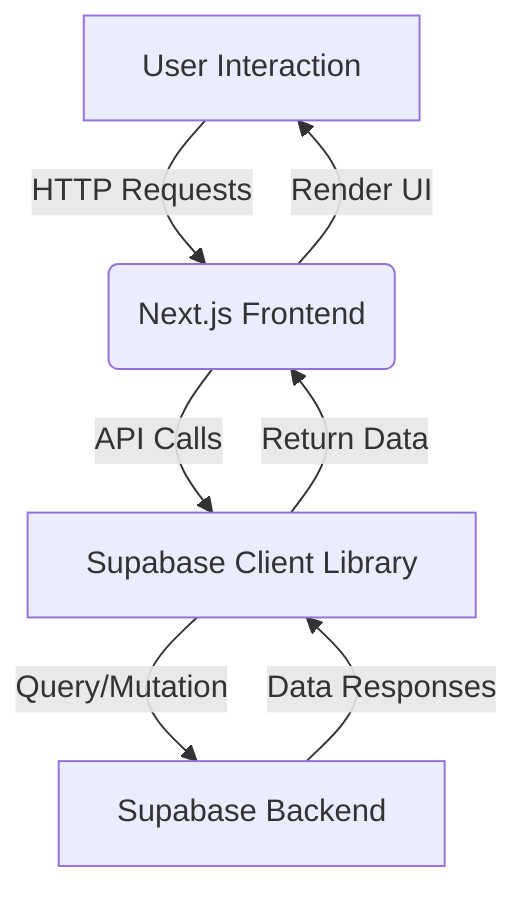
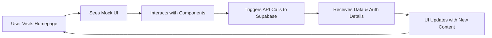

# Next.js & Supabase Project Starter

Welcome to the Next.js & Supabase Project Starter! This project is built with **Next.js** for the frontend and **Supabase** for the backend, and it leverages **Bun** as an ultra-fast JavaScript runtime along with **Docker** for container management. The project showcases a dynamic user interface with drag-and-drop features (using dnd-kit), interactive components (using Radix UI), and responsive design powered by Tailwind CSS.

## Table of Contents

- [Features](#features)
- [Setup and Installation](#setup-and-installation)
- [How It Works](#how-it-works)
  - [Data Flow](#data-flow)
  - [User Journey](#user-journey)
- [Running the Project](#running-the-project)
- [Project Structure](#project-structure)
- [Feedback and Issues](#feedback-and-issues)
- [License](#license)

## Features

- **Next.js Stack**: Enjoy both the App and Pages router with seamless integration.
- **Supabase Integration**: Leverage Supabase for backend and authentication functionality.
- **Drag-and-Drop Interface**: Powered by @dnd-kit for dynamic UI interactions.
- **Radix UI Components**: Utilize ready-to-use, accessible UI components.
- **Tailwind CSS**: Fast, responsive, and modern styling.
- **Bun Runtime**: Benefit from an ultra-fast JavaScript runtime for frontend development.
- **Docker Support**: Streamline your development environment with containerized services.
- **Modern Development Practices**: Includes typescript, prettier formatting and seamless local development setup.

## Setup and Installation

Before getting started, ensure you have the following prerequisites installed on your system:

- [Bun](https://bun.sh/) – For managing and running frontend dependencies.
- [Docker](https://www.docker.com/) – For containerizing and running your backend services.

### Step 1: Install Dependencies 
1. Open your terminal and navigate to the project root.
2. Run the following command to install the frontend dependencies using Bun:

   bun install

### Step 2: Setup Environment Variables
1. Copy `.env.example` to create a `.env.local` file in the root directory.
2. Update `.env.local` with your Supabase credentials:
   ```
   NEXT_PUBLIC_SUPABASE_URL=[YOUR_SUPABASE_PROJECT_URL]
   NEXT_PUBLIC_SUPABASE_ANON_KEY=[YOUR_SUPABASE_API_ANON_KEY]
   ```

### Step 3: Starting the Backend
To start the Supabase backend locally via Docker, use:

   npm run supabase-start

This command sets up the Supabase environment locally. Make sure Docker is running on your system.

### Step 4: Running the Development Server
Finally, start the Next.js development server with Bun:

   bun dev

Once running, navigate to http://localhost:3000 in your browser to see the application UI.

## How It Works

The project integrates a modern frontend built with Next.js that communicates with a Supabase backend. Below are diagrams explaining the data flow and user journey.

### Data Flow

Below is a Mermaid diagram that outlines how data flows through the system:



### User Journey

Below is a Mermaid diagram that demonstrates the typical user journey:



## Running the Project

To sum up, follow these commands to get the project up and running locally:

1. Install frontend dependencies:
   bun install

2. Start backend services:
   npm run supabase-start

3. Launch the Next.js development server:
   bun dev

Visit http://localhost:3000 to interact with the application.

## Project Structure

A quick glance at the core files and their purposes:

- package.json: Contains all project dependencies and scripts.
- .env.local: Local environment configuration (copy from .env.example).
- pages/ or app/: Next.js pages or application directories.
- components/: Reusable UI components using dnd-kit and Radix UI.
- styles/: Tailwind CSS configuration and global styles.
